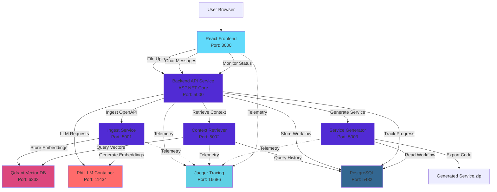

# Arazzo Workflow Generator Platform

## 🎯 Project Objective

A cloud-native platform that enables users to upload OpenAPI specifications and generate Arazzo workflows through an interactive chat interface powered by Phi LLM. The generated workflows are automatically converted into fully functional, documented C# business services with API endpoints and code export capabilities.

## 🏗️ Architecture Overview



## 🚀 Quick Start

### Prerequisites

- Docker Desktop (Windows/Mac) or Docker Engine + Docker Compose (Linux)
- 16GB RAM minimum (recommended: 32GB for optimal LLM performance)
- 50GB free disk space
- PowerShell 5.1+ (Windows) or Bash (Linux/Mac)

### One-Command Deployment

```powershell
# Clone the repository
git clone <repository-url>
cd arazzo-workflow-platform

# Start all services
docker-compose up -d

# Wait for all services to be healthy (this may take 2-3 minutes)
docker-compose ps

# Access the application
# Frontend: http://localhost:3000
# Backend API: http://localhost:5000/swagger
# Jaeger UI: http://localhost:16686
# Qdrant Dashboard: http://localhost:6333/dashboard
```

### Verify Installation

```powershell
# Check service health
docker-compose ps

# View logs for specific service
docker-compose logs -f backend-api

# View all logs
docker-compose logs -f
```

## 📁 Project Structure

```
arazzo-workflow-platform/
├── src/
│   ├── frontend/                          # React + Redux frontend
│   │   ├── public/
│   │   ├── src/
│   │   │   ├── api/                       # API client with axios
│   │   │   ├── components/                # React components
│   │   │   │   ├── FileUpload/
│   │   │   │   ├── Chat/
│   │   │   │   ├── ResponseRefining/
│   │   │   │   └── Monitor/
│   │   │   ├── store/                     # Redux Toolkit slices
│   │   │   ├── hooks/
│   │   │   ├── utils/
│   │   │   └── App.tsx
│   │   ├── Dockerfile
│   │   └── package.json
│   │
│   ├── backend/                           # Main Backend API (.NET 8)
│   │   ├── src/
│   │   │   ├── Domain/                    # Core entities & interfaces
│   │   │   ├── Application/               # Business logic & SK orchestration
│   │   │   ├── Infrastructure/            # Data access, external services
│   │   │   └── WebAPI/                    # Controllers, middleware
│   │   ├── tests/
│   │   ├── Dockerfile
│   │   └── BackendAPI.sln
│   │
│   ├── services/
│   │   ├── ingest-service/                # OpenAPI ingestion service
│   │   │   ├── src/
│   │   │   │   ├── Domain/
│   │   │   │   ├── Application/
│   │   │   │   ├── Infrastructure/
│   │   │   │   └── WebAPI/
│   │   │   ├── tests/
│   │   │   ├── Dockerfile
│   │   │   └── IngestService.sln
│   │   │
│   │   ├── context-retriever/             # Context retrieval service
│   │   │   ├── src/
│   │   │   │   ├── Domain/
│   │   │   │   ├── Application/
│   │   │   │   ├── Infrastructure/
│   │   │   │   └── WebAPI/
│   │   │   ├── tests/
│   │   │   ├── Dockerfile
│   │   │   └── ContextRetriever.sln
│   │   │
│   │   └── service-generator/             # Code generation service
│   │       ├── src/
│   │       │   ├── Domain/
│   │       │   ├── Application/
│   │       │   ├── Infrastructure/
│   │       │   └── WebAPI/
│   │       ├── templates/                 # Scriban templates
│   │       ├── tests/
│   │       ├── Dockerfile
│   │       └── ServiceGenerator.sln
│   │
├── infrastructure/
│   ├── docker/
│   │   ├── phi-llm/                       # Phi LLM container config
│   │   └── qdrant/                        # Qdrant configuration
│   │
│   ├── database/
│   │   ├── init/
│   │   │   └── 01-init-schema.sql         # Initial DB schema
│   │   └── migrations/
│   │
│   └── observability/
│       ├── jaeger/                        # Jaeger configuration
│       └── otel-collector/                # OpenTelemetry collector
│
├── docs/
│   ├── architecture/
│   │   ├── 01-high-level-architecture.md
│   │   ├── 02-service-breakdown.md
│   │   ├── 03-data-flow.md
│   │   └── 04-arazzo-workflow-schema.md
│   │
│   ├── api/
│   │   ├── backend-api.md
│   │   ├── ingest-service.md
│   │   ├── context-retriever.md
│   │   └── service-generator.md
│   │
│   └── deployment/
│       ├── local-setup.md
│       ├── configuration.md
│       └── troubleshooting.md
│
├── scripts/
│   ├── setup.ps1                          # Windows setup script
│   ├── setup.sh                           # Linux/Mac setup script
│   ├── seed-data.ps1                      # Seed sample data
│   └── cleanup.ps1                        # Cleanup script
│
├── .env.example                           # Environment variables template
├── .env                                   # Local environment (gitignored)
├── docker-compose.yml                     # Main orchestration file
├── docker-compose.override.yml            # Local development overrides
├── .gitignore
├── README.md                              # This file
└── LICENSE
```

## 🔧 Configuration

### Environment Variables

Copy `.env.example` to `.env` and configure:

```bash
# API Security
API_KEY=your-secure-api-key-here

# Database
POSTGRES_USER=arazzo_user
POSTGRES_PASSWORD=your-secure-password
POSTGRES_DB=arazzo_platform
DATABASE_CONNECTION_STRING=Host=postgres;Port=5432;Database=arazzo_platform;Username=arazzo_user;Password=your-secure-password

# Qdrant Vector DB
QDRANT_HOST=qdrant
QDRANT_PORT=6333
QDRANT_API_KEY=your-qdrant-api-key

# Phi LLM
PHI_LLM_ENDPOINT=http://phi-llm:11434
PHI_MODEL_NAME=phi3:latest

# Service URLs
BACKEND_API_URL=http://backend-api:5000
INGEST_SERVICE_URL=http://ingest-service:5001
CONTEXT_RETRIEVER_URL=http://context-retriever:5002
SERVICE_GENERATOR_URL=http://service-generator:5003

# OpenTelemetry
OTEL_EXPORTER_OTLP_ENDPOINT=http://jaeger:4317
OTEL_SERVICE_NAME_PREFIX=arazzo-platform

# Frontend
REACT_APP_API_URL=http://localhost:5000
REACT_APP_API_KEY=your-secure-api-key-here

# Logging
LOG_LEVEL=Information
```

## 🏃 Development Workflow

### Starting Individual Services

```powershell
# Start only infrastructure services
docker-compose up -d postgres qdrant phi-llm jaeger

# Start backend services
docker-compose up -d backend-api ingest-service context-retriever service-generator

# Start frontend
docker-compose up -d frontend
```

### Running Tests

```powershell
# Run all backend tests
docker-compose run --rm backend-api dotnet test

# Run specific service tests
docker-compose run --rm ingest-service dotnet test
docker-compose run --rm context-retriever dotnet test
docker-compose run --rm service-generator dotnet test

# Run frontend tests
docker-compose run --rm frontend npm test
```

### Rebuilding Services

```powershell
# Rebuild all services
docker-compose build

# Rebuild specific service
docker-compose build backend-api

# Rebuild and restart
docker-compose up -d --build backend-api
```

## 📊 Monitoring & Observability

### Jaeger Tracing

Access Jaeger UI at `http://localhost:16686`

- View distributed traces across all services
- Analyze latency and bottlenecks
- Debug cross-service communication

### Application Logs

```powershell
# View logs for all services
docker-compose logs -f

# Filter by service
docker-compose logs -f backend-api

# View last 100 lines
docker-compose logs --tail=100 backend-api

# Export logs to file
docker-compose logs backend-api > backend-logs.txt
```

### Health Checks

```powershell
# Check health endpoints
curl http://localhost:5000/health
curl http://localhost:5001/health
curl http://localhost:5002/health
curl http://localhost:5003/health
```

## 🔐 Security

### API Authentication

All backend endpoints require an API key passed in the `X-API-Key` header:

```bash
curl -H "X-API-Key: your-secure-api-key-here" http://localhost:5000/api/workflows
```

### Network Security

- All inter-service communication uses internal Docker network
- Only essential ports are exposed to host
- Database credentials are managed via environment variables

## 📚 API Documentation

### Backend API Endpoints

#### File Upload
```
POST /api/files/upload
Content-Type: multipart/form-data
X-API-Key: {api_key}

Body: file (OpenAPI spec)
```

#### Chat Interaction
```
POST /api/chat/message
Content-Type: application/json
X-API-Key: {api_key}

Body: {
  "message": "Create a workflow for user authentication",
  "sessionId": "uuid",
  "workflowId": "uuid"
}
```

#### Generate Service
```
POST /api/workflows/{workflowId}/generate
X-API-Key: {api_key}

Response: application/zip (Generated C# service)
```

#### Monitor Progress
```
GET /api/workflows/{workflowId}/progress
X-API-Key: {api_key}

Response: {
  "workflowId": "uuid",
  "status": "InProgress",
  "completedSteps": 3,
  "totalSteps": 5,
  "interactions": [...]
}
```

### Swagger Documentation

Access interactive API documentation:
- Backend API: `http://localhost:5000/swagger`
- Ingest Service: `http://localhost:5001/swagger`
- Context Retriever: `http://localhost:5002/swagger`
- Service Generator: `http://localhost:5003/swagger`

## 🧪 Testing

### Manual Testing Flow

1. **Upload OpenAPI Spec**: Navigate to `http://localhost:3000/upload`
2. **Start Chat**: Click "Start New Workflow"
3. **Interact with LLM**: Describe your desired workflow
4. **Review Generated Workflow**: Check the Arazzo workflow JSON
5. **Generate Service**: Click "Generate Service"
6. **Download**: Download the generated .zip file
7. **Monitor**: View progress on the Monitor page

### Sample OpenAPI Specs

Sample specifications are provided in `docs/samples/`:
- `petstore-openapi.yaml`
- `user-management-openapi.yaml`
- `ecommerce-openapi.yaml`

## 🐛 Troubleshooting

### Common Issues

#### Services Not Starting
```powershell
# Check Docker daemon
docker info

# Restart Docker Desktop
# Check logs
docker-compose logs
```

#### Port Conflicts
```powershell
# Check which process is using a port
netstat -ano | findstr :5000

# Kill the process (replace PID)
taskkill /F /PID <PID>
```

#### Database Connection Issues
```powershell
# Verify PostgreSQL is running
docker-compose ps postgres

# Check connection
docker-compose exec postgres psql -U arazzo_user -d arazzo_platform
```

#### Phi LLM Not Responding
```powershell
# Check LLM container
docker-compose logs phi-llm

# Restart LLM service
docker-compose restart phi-llm

# Pull latest model
docker-compose exec phi-llm ollama pull phi3:latest
```

#### Out of Memory
```powershell
# Increase Docker Desktop memory allocation
# Settings > Resources > Advanced > Memory: 16GB minimum

# Or reduce service resources in docker-compose.yml
```

## 🔄 Updates & Maintenance

### Updating Dependencies

```powershell
# Update .NET packages
cd src/backend
dotnet list package --outdated
dotnet add package <PackageName>

# Update npm packages
cd src/frontend
npm outdated
npm update
```

### Database Migrations

```powershell
# Create new migration
docker-compose exec backend-api dotnet ef migrations add <MigrationName>

# Apply migrations
docker-compose exec backend-api dotnet ef database update
```

### Backup & Restore

```powershell
# Backup database
docker-compose exec postgres pg_dump -U arazzo_user arazzo_platform > backup.sql

# Restore database
cat backup.sql | docker-compose exec -T postgres psql -U arazzo_user arazzo_platform

# Backup Qdrant
docker-compose exec qdrant curl -X POST http://localhost:6333/collections/openapi_embeddings/snapshots
```

## 📈 Performance Optimization

### Recommended Resource Allocation

- **Phi LLM**: 8GB RAM, 4 CPU cores
- **PostgreSQL**: 2GB RAM, 2 CPU cores
- **Qdrant**: 2GB RAM, 2 CPU cores
- **Backend Services**: 1GB RAM each, 1 CPU core
- **Frontend**: 512MB RAM, 1 CPU core

### Scaling Considerations

```yaml
# Scale specific services
docker-compose up -d --scale backend-api=3

# Use nginx for load balancing (see docs/deployment/load-balancing.md)
```

## 🤝 Contributing

Please read [CONTRIBUTING.md](CONTRIBUTING.md) for development guidelines.

## 📄 License

This project is licensed under the MIT License - see [LICENSE](LICENSE) file.

## 🆘 Support

- **Documentation**: [docs/](docs/)
- **Issues**: Create an issue in the repository
- **Discussions**: Use GitHub Discussions for questions

## 🗺️ Roadmap

### Phase 0: Foundation (Current)
- ✅ Docker Compose setup
- ✅ Observability infrastructure
- ✅ Project structure

### Phase 1: Ingestion & Retrieval (Week 1-2)
- [ ] Ingest Service implementation
- [ ] Context Retriever implementation
- [ ] Qdrant integration
- [ ] Vector search testing

### Phase 2: Core Orchestration (Week 3-4)
- [ ] Semantic Kernel integration
- [ ] LLM orchestration flows
- [ ] Arazzo workflow generation
- [ ] Progress monitoring

### Phase 3: Service Generation & UI (Week 5-6)
- [ ] Service Generator with Scriban templates
- [ ] React frontend components
- [ ] Redux state management
- [ ] End-to-end workflow

### Phase 4: Polish & Testing (Week 7-8)
- [ ] Comprehensive testing
- [ ] Error handling refinement
- [ ] Performance optimization
- [ ] Documentation completion

## 📞 Contact

For questions or support, please contact the development team.

---

**Built with ❤️ using .NET 8, React, Semantic Kernel, and Phi LLM**
