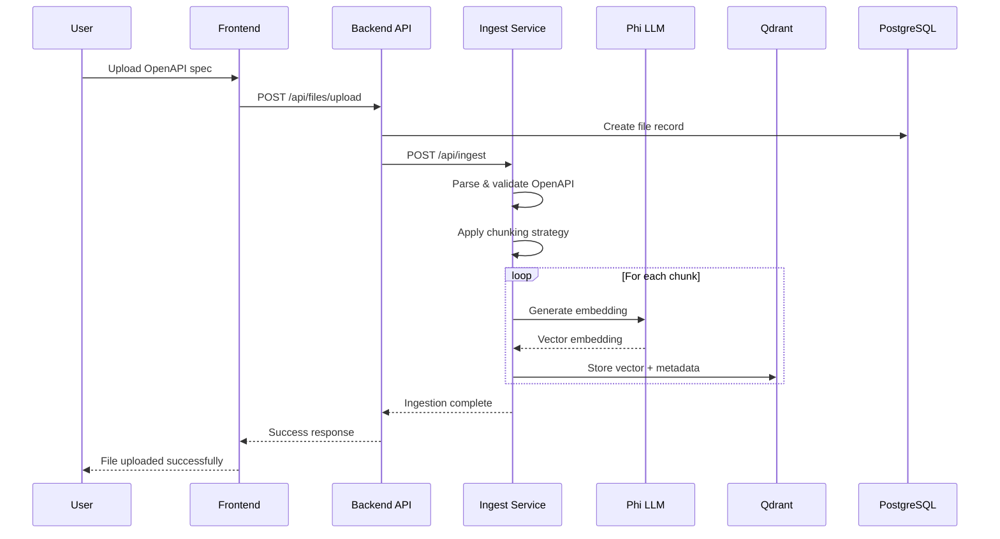
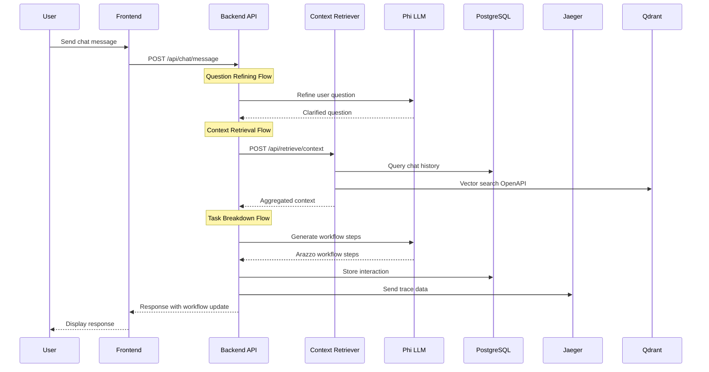
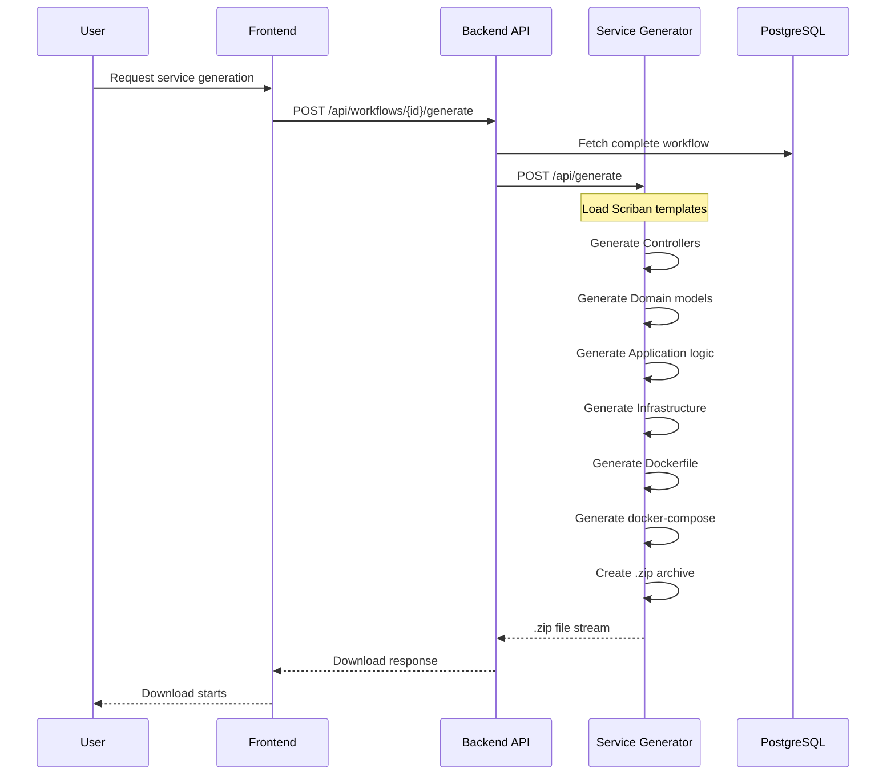

# High-Level Architecture

## System Overview

The Arazzo Workflow Generator Platform is a distributed, microservices-based system designed for local-first deployment with enterprise-grade observability, resiliency, and security patterns.

## Architectural Principles

1. **Microservices Architecture**: Each service has a single responsibility and can be developed, deployed, and scaled independently
2. **Clean Architecture**: All C# services follow Clean Architecture patterns with clear separation of concerns
3. **Event-Driven Communication**: Services communicate asynchronously where appropriate
4. **Cloud-Native Patterns**: Designed with containers, health checks, and graceful shutdown
5. **Observability First**: OpenTelemetry integration from day one
6. **Resiliency Built-In**: Polly policies for retry, circuit breaker, and timeout patterns

## Service Inventory

### User-Facing Services

#### 1. Frontend (React + Redux)
- **Port**: 3000
- **Purpose**: User interface for file upload, chat interaction, and monitoring
- **Technology**: React 18, Redux Toolkit, TypeScript, Axios
- **Container**: Nginx serving static build

#### 2. Backend API Service
- **Port**: 5000
- **Purpose**: Main orchestration service coordinating all workflows
- **Technology**: ASP.NET Core 8, Semantic Kernel, Entity Framework Core
- **Key Features**:
  - File upload management
  - Chat message processing
  - Workflow orchestration
  - Progress tracking
  - LLM interaction coordination

### Supporting Microservices

#### 3. Ingest Service
- **Port**: 5001
- **Purpose**: Process and vectorize OpenAPI specifications
- **Technology**: ASP.NET Core 8, Semantic Kernel
- **Workflow**:
  1. Receive OpenAPI spec
  2. Parse and validate
  3. Apply chunking strategy
  4. Generate embeddings via Phi LLM
  5. Store vectors in Qdrant

#### 4. Context Retriever Service
- **Port**: 5002
- **Purpose**: Aggregate context from multiple sources for LLM prompts
- **Technology**: ASP.NET Core 8, Semantic Kernel
- **Data Sources**:
  - User chat history (PostgreSQL)
  - OpenAPI knowledge (Qdrant vector search)
  - Optional internet knowledge (plugin)

#### 5. Service Generator
- **Port**: 5003
- **Purpose**: Transform Arazzo workflows into C# code projects
- **Technology**: ASP.NET Core 8, Scriban templating
- **Output**: Compilable .NET 8 solution with:
  - Controllers and endpoints
  - Domain models
  - Business logic
  - API documentation (Swagger)
  - Docker support

### Infrastructure Services

#### 6. Phi LLM Container
- **Port**: 11434
- **Purpose**: Large Language Model for workflow generation
- **Technology**: Ollama serving Phi-3
- **Model**: microsoft/phi-3-mini-4k-instruct

#### 7. Qdrant Vector Database
- **Port**: 6333 (HTTP), 6334 (gRPC)
- **Purpose**: Store and query OpenAPI spec embeddings
- **Collections**:
  - `openapi_embeddings`: Vector size 1536 (or model-specific)

#### 8. PostgreSQL Database
- **Port**: 5432
- **Purpose**: Persistent storage for workflows and interaction history
- **Databases**:
  - `arazzo_platform`: Main application database

#### 9. Jaeger Tracing
- **Port**: 16686 (UI), 4317 (OTLP)
- **Purpose**: Distributed tracing and observability
- **Storage**: In-memory (local dev) or persistent (production)

## Data Flow Diagrams

### 1. OpenAPI Ingestion Flow



### 2. Chat Interaction Flow



### 3. Service Generation Flow



## Cross-Cutting Concerns

### Security

1. **API Authentication**: X-API-Key header validation on all backend endpoints
2. **CORS Policy**: Configured to allow frontend origin
3. **Input Validation**: FluentValidation on all DTOs
4. **SQL Injection Prevention**: Parameterized queries via EF Core
5. **File Upload Validation**: File type, size, and content validation

### Resiliency

All service-to-service HTTP calls implement Polly policies:

```csharp
// Retry policy: 3 attempts with exponential backoff
.AddPolicyHandler(Policy
    .HandleTransientHttpError()
    .WaitAndRetryAsync(3, retryAttempt => 
        TimeSpan.FromSeconds(Math.Pow(2, retryAttempt))))

// Circuit breaker: Break after 5 consecutive failures
.AddPolicyHandler(Policy
    .HandleTransientHttpError()
    .CircuitBreakerAsync(5, TimeSpan.FromSeconds(30)))

// Timeout: 30 seconds per request
.AddPolicyHandler(Policy.TimeoutAsync<HttpResponseMessage>(30))
```

### Observability

#### OpenTelemetry Configuration

All services are instrumented with:

1. **Tracing**: Distributed traces across all service boundaries
2. **Metrics**: Custom metrics for business events
3. **Logging**: Structured logs correlated with traces

```csharp
services.AddOpenTelemetry()
    .WithTracing(builder => builder
        .AddAspNetCoreInstrumentation()
        .AddHttpClientInstrumentation()
        .AddEntityFrameworkCoreInstrumentation()
        .AddSource("SemanticKernel.*")
        .AddOtlpExporter(options => 
            options.Endpoint = new Uri(config["OTEL_EXPORTER_OTLP_ENDPOINT"])))
    .WithMetrics(builder => builder
        .AddAspNetCoreInstrumentation()
        .AddHttpClientInstrumentation()
        .AddRuntimeInstrumentation()
        .AddOtlpExporter());
```

#### Frontend Telemetry

React components use OpenTelemetry JS:

```typescript
import { WebTracerProvider } from '@opentelemetry/sdk-trace-web';
import { OTLPTraceExporter } from '@opentelemetry/exporter-trace-otlp-http';

const provider = new WebTracerProvider();
provider.addSpanProcessor(new BatchSpanProcessor(
  new OTLPTraceExporter({ url: 'http://localhost:4318/v1/traces' })
));
```

### Configuration Management

All configuration externalized via:

1. **Environment Variables**: Docker Compose `.env` file
2. **appsettings.json**: Default configuration
3. **appsettings.Development.json**: Development overrides
4. **Azure Key Vault** (future): Production secrets

Example configuration binding:

```csharp
services.Configure<SemanticKernelOptions>(
    configuration.GetSection("SemanticKernel"));
services.Configure<QdrantOptions>(
    configuration.GetSection("Qdrant"));
```

## Deployment Architecture

### Docker Compose Networking

All services communicate over a custom bridge network:

```yaml
networks:
  arazzo-network:
    driver: bridge
    ipam:
      config:
        - subnet: 172.28.0.0/16
```

### Volume Management

Persistent data volumes:

- `postgres-data`: PostgreSQL data
- `qdrant-data`: Vector database storage
- `phi-models`: LLM model cache
- `uploads`: Temporary file uploads

### Health Check Strategy

All services expose `/health` endpoints:

```yaml
healthcheck:
  test: ["CMD", "curl", "-f", "http://localhost:5000/health"]
  interval: 30s
  timeout: 10s
  retries: 3
  start_period: 40s
```

## Scalability Considerations

### Horizontal Scaling

Services designed for stateless horizontal scaling:

```bash
docker-compose up -d --scale backend-api=3
```

### Vertical Scaling

Resource limits defined per service:

```yaml
deploy:
  resources:
    limits:
      cpus: '2.0'
      memory: 4G
    reservations:
      cpus: '1.0'
      memory: 2G
```

### Caching Strategy

1. **Response Caching**: Cache identical LLM responses
2. **Vector Caching**: Cache frequent vector search results
3. **Redis** (future): Distributed cache for multi-instance deployments

## Security Threat Model

### Identified Threats

1. **Unauthorized API Access**: Mitigated by API key authentication
2. **Malicious File Upload**: Mitigated by file validation and scanning
3. **Prompt Injection**: Mitigated by input sanitization
4. **DoS Attacks**: Mitigated by rate limiting (future implementation)
5. **Data Exfiltration**: Mitigated by network isolation

### Future Security Enhancements

1. OAuth 2.0 / OpenID Connect integration
2. Role-Based Access Control (RBAC)
3. Audit logging
4. File malware scanning
5. API rate limiting
6. Web Application Firewall (WAF)

## Performance Targets

### Response Time SLAs

- File upload: < 2s (for files < 10MB)
- Chat message: < 5s (with LLM processing)
- Service generation: < 30s (for typical workflows)
- Vector search: < 500ms

### Throughput Targets

- Concurrent users: 50-100 (local deployment)
- Chat messages: 100/minute
- File uploads: 20/minute
- Service generations: 10/minute

### Resource Consumption

- Total RAM: 16GB recommended
- Total CPU: 8 cores recommended
- Disk I/O: SSD recommended for PostgreSQL and Qdrant
- Network: 1 Gbps for LLM communication

## Technology Decisions

### Why Semantic Kernel?

- **Native .NET Integration**: First-class C# support
- **Plugin Architecture**: Extensible with custom functions
- **Memory & Embeddings**: Built-in support for RAG patterns
- **Prompt Management**: Template-based prompt engineering
- **Planning**: Auto-planning capabilities for complex workflows

### Why Phi LLM?

- **Size**: Small enough for local deployment (3B parameters)
- **Performance**: Fast inference on consumer hardware
- **Quality**: Strong reasoning capabilities for code generation
- **Open Source**: Free for commercial use
- **Ollama Support**: Easy containerization

### Why Qdrant?

- **Performance**: Highly optimized vector search
- **Features**: Rich filtering and hybrid search
- **API**: RESTful and gRPC APIs
- **Open Source**: No licensing costs
- **Docker Support**: Easy local deployment

### Why PostgreSQL?

- **Reliability**: Battle-tested ACID compliance
- **JSON Support**: Native JSONB for flexible schemas
- **Extensions**: pgvector for hybrid storage (future)
- **Community**: Large ecosystem and tooling
- **Performance**: Excellent for transactional workloads

## Next Steps

Proceed to [02-service-breakdown.md](./02-service-breakdown.md) for detailed service implementation specifications.
